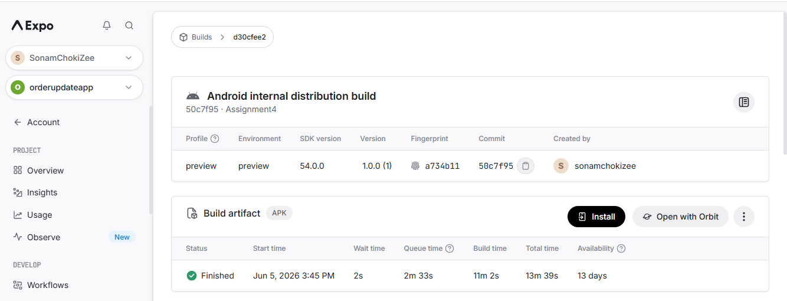
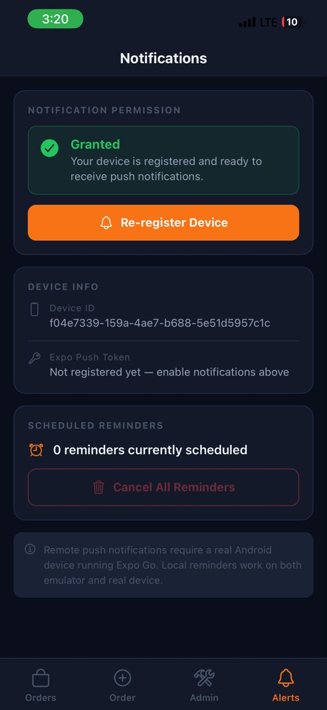
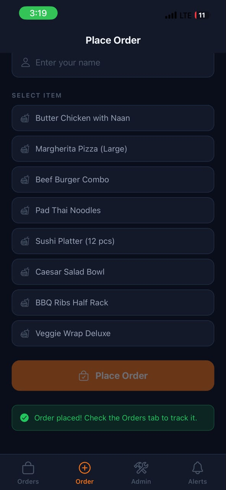
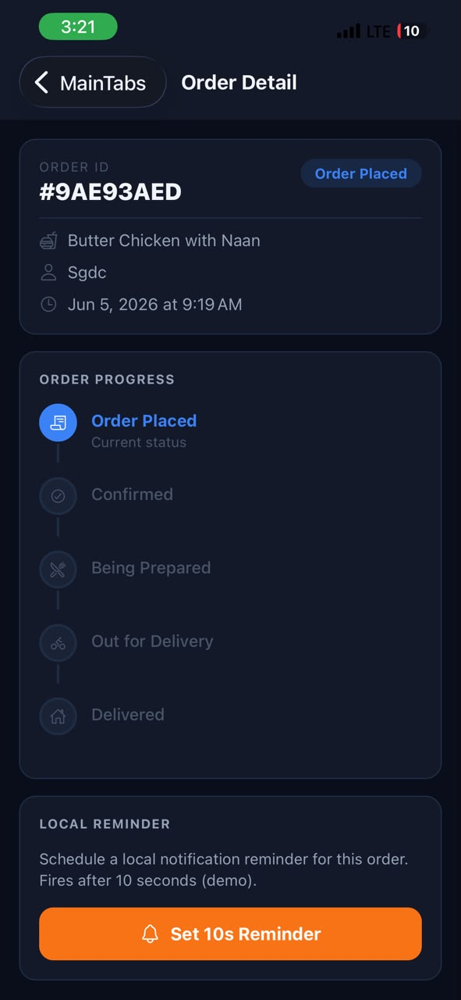
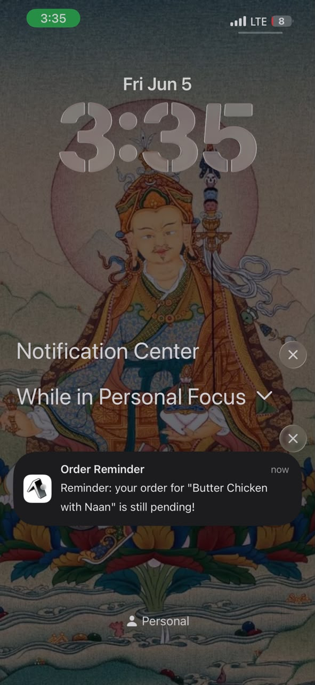

# OrderUpdateApp 

A full-stack food delivery order tracking application with real-time push notifications. Built with React Native (Expo) frontend and Node.js/Express backend.

---

## Overview

OrderUpdateApp allows customers to place food orders and receive real-time push notifications when their order status changes. Restaurant staff can update order statuses through an admin interface, triggering instant notifications to the customer's device.

### Key Features

- **Place orders** with customer name and menu items
- **Track order status** with visual progress indicator 
- **Push notifications** for status updates 
- **Admin panel** to update order statuses and broadcast messages
- **Local reminders** as fallback when push notifications aren't available
- **Pull-to-refresh** orders list


---

## Tech Stack

### Backend
| Tool | Purpose |
|---|---|
| Node.js + Express | HTTP server and routing |
| better-sqlite3 | SQLite database (file-based, no server required) |
| expo-server-sdk | Sends push notifications through Expo's infrastructure |
| dotenv | Environment variable management |

### Frontend
| Tool | Purpose |
|---|---|
| React Native + Expo SDK 54 | Mobile app framework |
| TypeScript | Type safety |
| Expo Notifications | Push notification handling on device |
| Expo Router / React Navigation | Navigation between screens |
| Axios | HTTP client for API calls |

---

## Project Structure

```
OrderUpdateApp/
├── backend/
│   ├── src/
│   │   ├── index.js                    Entry point — Express setup
│   │   ├── db/
│   │   │   └── database.js             SQLite init, table creation
│   │   ├── middleware/
│   │   │   └── auth.js                 API key verification
│   │   ├── services/
│   │   │   └── pushService.js          Expo push logic
│   │   ├── controllers/
│   │   │   ├── tokenController.js      Push token registration
│   │   │   ├── orderController.js      Order CRUD + push trigger
│   │   │   └── notifyController.js     Broadcast/single push
│   │   └── routes/
│   │       ├── tokenRoutes.js
│   │       ├── orderRoutes.js
│   │       └── notifyRoutes.js
│   ├── data/                           Auto-created — SQLite database
│   ├── .env.example
│   └── package.json
│
├── frontend/
│   ├── App.tsx                         Entry point — notification listeners
│   ├── app.json                        Expo project config
│   ├── eas.json                        EAS Build config
│   ├── src/
│   │   ├── api/index.ts                HTTP calls to backend
│   │   ├── constants/index.ts          Colors, status config, menu items
│   │   ├── navigation/index.tsx        Stack + tab navigator
│   │   ├── notifications/index.ts      Expo Notifications logic
│   │   ├── screens/
│   │   │   ├── OrdersScreen.tsx        List all orders
│   │   │   ├── OrderDetailScreen.tsx   Status tracker + reminders
│   │   │   ├── PlaceOrderScreen.tsx    Create new order
│   │   │   ├── AdminScreen.tsx         Status updates + broadcast
│   │   │   └── SettingsScreen.tsx      Permission state, token display
│   │   └── types/index.ts              Shared TypeScript types
│   └── assets/                         Icons and splash image
```

---

## Backend Setup

### Prerequisites
- Node.js (v18 or later)
- npm

### Installation

```bash
cd backend
npm install
cp .env.example .env
```

### Configuration

Edit `.env`:
```
PORT=4000
API_KEY=mysecretkey123
```

### Running the Server

```bash
npm run dev       
npm start         
```


### Database Schema

```sql
tokens (
  device_id TEXT PRIMARY KEY,
  token TEXT,
  user_id TEXT,
  created_at TEXT
)

orders (
  id TEXT PRIMARY KEY,
  customer_name TEXT,
  item TEXT,
  status TEXT,
  device_id TEXT,
  created_at TEXT,
  updated_at TEXT
)
```

---

## Frontend Setup

### Prerequisites
- Node.js (v18 or later)
- Expo Go app 
- Expo CLI (`npm install -g expo-cli`)

### Installation

```bash
cd frontend
npm install
cp .env.example .env
```

### Configuration

Edit `.env`:
```
EXPO_PUBLIC_API_URL=http://YOUR_LOCAL_IP:4000
EXPO_PUBLIC_API_KEY=mysecretkey123
```


### Running the App

```bash
npx expo start
```

Scan the QR code with Expo Go (Android) or Camera app (iOS).

### Building APK

```bash
eas build -p android --profile preview
```

---

## API Endpoints

### Public (No Auth)
| Method | URL | Description |
|---|---|---|
| GET | `/health` | Health check |
| POST | `/tokens` | Register device push token |
| POST | `/orders` | Create new order |
| GET | `/orders` | List all orders |
| GET | `/orders/:id` | Get single order |

### Admin (Requires `x-api-key` header)
| Method | URL | Description |
|---|---|---|
| GET | `/tokens` | List all registered tokens |
| PATCH | `/orders/:id/status` | Update order status + send push |
| POST | `/notify/broadcast` | Send push to all devices |
| POST | `/notify/device` | Send push to single device |

### Valid Order Statuses
`placed` → `confirmed` → `preparing` → `out_for_delivery` → `delivered`

---

## Example API Calls

### Health Check
```bash
curl http://localhost:4000/health
```

### Create an Order
```bash
curl -X POST http://localhost:4000/orders \
  -H "Content-Type: application/json" \
  -d '{"customerName":"Sdgc","item":"Butter Chicken","deviceId":"my-device-123"}'
```

### Update Order Status (Triggers Push Notification)
```bash
curl -X PATCH http://localhost:4000/orders/ORDER_ID/status \
  -H "Content-Type: application/json" \
  -H "x-api-key: mysecretkey123" \
  -d '{"status":"out_for_delivery"}'
```

### Broadcast to All Devices
```bash
curl -X POST http://localhost:4000/notify/broadcast \
  -H "Content-Type: application/json" \
  -H "x-api-key: mysecretkey123" \
  -d '{"title":"Special Offer","body":"20% off your next order!"}'
```

---

## Testing Push Notifications

### Prerequisites for Push Notifications

1. **Physical device required** — iOS simulator doesn't support push notifications
2. **Run in production mode** or use Expo's development build:
   ```bash
   npx expo start --production
   ```
   Or build and install the APK:
   ```bash
   eas build -p android --profile preview
   ```

### Testing Flow

1. **Open the app** → Navigate to **Alerts** tab
   - Tap **Enable Notifications** → Allow permissions
   - Verify "Granted" status and push token appears

2. **Place an order** → **Order** tab
   - Enter your name → Select an item → **Place Order**

3. **View orders** → **Orders** tab
   - See all orders with status badges
   - Pull down to refresh

4. **Test automatic push** → **Admin** tab
   - Find your order → Tap the next status chip
   - Background the app → Push notification appears

5. **Test local reminder** → **Order Detail** screen
   - Tap **Set 10s Reminder** → Background the app
   - Local notification appears after 10 seconds

6. **Test deep linking**
   - Tap notification from system tray
   - App opens directly to that order's detail screen

### Common Issues

| Problem | Solution |
|---------|----------|
| Notifications not arriving | Ensure device has internet, app has permissions, and backend is reachable |
| iOS simulator no notifications | Simulator doesn't support pushes — use physical device |
| "Invalid credentials" | Check API_KEY matches backend |
| Connection refused | Use local IP address, not localhost, on physical device |

---

## Environment Variables

### Backend (.env)
| Variable | Default | Description |
|----------|---------|-------------|
| PORT | 4000 | Server port |
| API_KEY | mysecretkey123 | Admin API authentication |

### Frontend (.env)
| Variable | Description |
|----------|-------------|
| EXPO_PUBLIC_API_URL | Backend URL (e.g., `http://192.168.1.100:4000`) |
| EXPO_PUBLIC_API_KEY | Admin API key (must match backend) |

---

## Screenshots

| Alerts Tab | Orders List | Order Detail |
|------------|-------------|---------------|
| Green "Granted" indicator + push token | Coloured status badges | 5-step status tracker + reminder button |
| | |  |

| Push Notification |
|-------------------|
| System tray notification |
|  |

---

## Troubleshooting

### Backend won't start
- Check if port 4000 is already in use
- Verify SQLite has write permissions in `data/` folder

### Frontend can't connect to backend
- Ensure both devices are on the same WiFi network
- Check backend is running (`curl http://YOUR_IP:4000/health`)
- Update `EXPO_PUBLIC_API_URL` with correct IP address

### Push tokens not registering
- Verify notification permissions are granted
- Check backend logs for token registration errors

### Notifications not arriving
- Physical device required (not simulator)

---