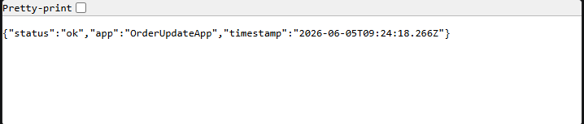
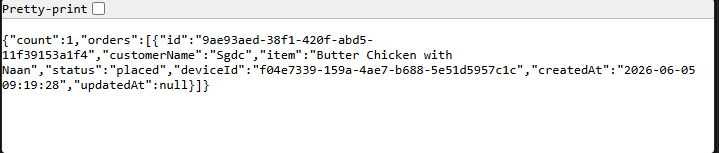
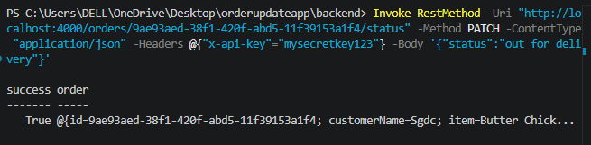
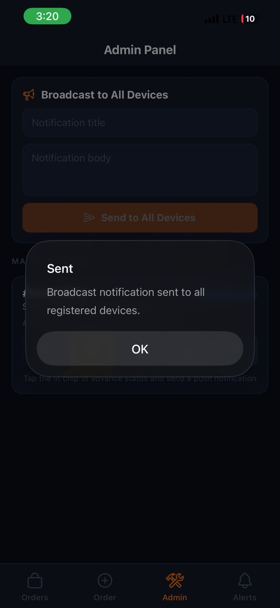

# OrderUpdateApp — Backend

Node.js + Express REST API with SQLite database. Stores Expo push tokens and triggers push notifications via the Expo Push API.

---

## Tech Stack

| Tool | Purpose |
|---|---|
| Node.js + Express | HTTP server and routing |
| better-sqlite3 | SQLite database (file-based, no server required) |
| expo-server-sdk | Sends push notifications through Expo's infrastructure |
| dotenv | Environment variable management |

---

## Folder Structure

```
backend/
├── src/
│   ├── index.js                    Entry point — Express setup, route mounting
│   ├── db/
│   │   └── database.js             SQLite init, table creation, WAL mode
│   ├── middleware/
│   │   └── auth.js                 API key check for admin routes
│   ├── services/
│   │   └── pushService.js          Expo push logic (chunking, sending, message builder)
│   ├── controllers/
│   │   ├── tokenController.js      Register and list device push tokens
│   │   ├── orderController.js      Create, list, get, and update orders + push trigger
│   │   └── notifyController.js     Broadcast and single-device push
│   └── routes/
│       ├── tokenRoutes.js
│       ├── orderRoutes.js
│       └── notifyRoutes.js
├── data/                           Auto-created — contains orderupdateapp.db (SQLite file)
├── .env.example
└── package.json
```

---

## Database

SQLite file is created automatically at `data/orderupdateapp.db` on first run.

**Tables:**

```sql
tokens (device_id TEXT PK, token TEXT, user_id TEXT, created_at TEXT)
orders (id TEXT PK, customer_name TEXT, item TEXT, status TEXT, device_id TEXT, created_at TEXT, updated_at TEXT)
```

---

## Setup

```bash
cd backend
npm install
cp .env.example .env
```

Edit `.env`:
```
PORT=4000
API_KEY=mysecretkey123
```

Start the server:
```bash
npm run dev       # development with auto-restart
npm start         # production
```

---

## Endpoints

| Method | URL | Auth | Description |
|---|---|---|---|
| GET | `/health` | None | Health check |
| POST | `/tokens` | None | Register a device push token |
| GET | `/tokens` | API Key | List all tokens |
| POST | `/orders` | None | Create a new order |
| GET | `/orders` | None | List all orders |
| GET | `/orders/:id` | None | Get one order |
| PATCH | `/orders/:id/status` | API Key | Update status + send push |
| POST | `/notify/broadcast` | API Key | Push to all devices |
| POST | `/notify/device` | API Key | Push to one device |

Admin routes require: `x-api-key: <your API_KEY>` header.

---

## Example Requests

### Health check
```bash
curl http://localhost:4000/health
```


### Create an order
```bash
curl -X POST http://localhost:4000/orders \
  -H "Content-Type: application/json" \
  -d '{"customerName":"Sdgc","item":"Butter Chicken","deviceId":"my-device-123"}'
```


### Update order status and trigger push
```bash
curl -X PATCH http://localhost:4000/orders/ORDER_ID/status \
  -H "Content-Type: application/json" \
  -H "x-api-key: mysecretkey123" \
  -d '{"status":"out_for_delivery"}'

```



Valid statuses: `placed` `confirmed` `preparing` `out_for_delivery` `delivered`

### Broadcast to all devices
```bash
curl -X POST http://localhost:4000/notify/broadcast \
  ```



### Push to one device
```bash
curl -X POST http://localhost:4000/notify/device \
  ```
